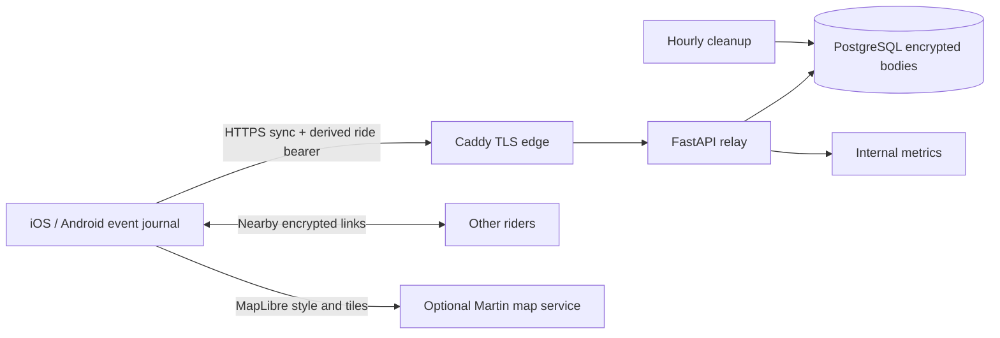

# Server architecture

## Scope and requirements

The server is an ephemeral coordination relay, not the source of truth for a
ride. It must accept signed mobile event envelopes, return missing envelopes to
other members, tolerate retries and reordering, minimize precise-location
retention, and recover without user intervention. It must not receive the
ride invitation secret or claim that server acceptance proves rider delivery.

## Components

- **Caddy:** automatic TLS, public API routing, map routing, and denial of the
  internal metrics endpoint.
- **FastAPI relay:** validates protocol bounds, authenticates a ride, applies
  idempotency, stores events, and builds bounded cursor pages.
- **PostgreSQL:** durable rides, encrypted event envelopes, and encrypted exact
  idempotency replays. Alembic owns the schema.
- **Cleanup worker:** removes expired events/replays and cascades expired rides.
- **Martin (optional):** serves operator-supplied MBTiles/PMTiles over ordinary
  vector-tile URLs for MapLibre display and native offline-region downloads.

## API and consistency

There is one mutation/query endpoint: `POST
/api/v1/rides/{ride_id}/events:sync`. An idempotency key is the SHA-256 of the
exact request bytes. A successful result is stored and replayed byte-for-byte.
Event identity is unique within a ride; repeating the same body is safe and
reusing the ID for a different body is a conflict.

The first credential for an unclaimed, high-entropy ride ID wins atomically.
This keeps the mobile protocol account-free. It assumes ride IDs and private
invitations are unguessable and makes private invitation handling part of the
security boundary.

Opaque cursors contain a monotonically increasing database sequence and a
ride-bound HMAC. Expired records can create gaps without invalidating cursor
ordering. Responses stop at 100 events or 128 KiB, whichever comes first.

## Storage and privacy

The database stores a token hash and AES-256-GCM ciphertext. Event ride/type,
device ID, timestamps, expiry, and hashes remain queryable metadata so the
relay can enforce retention and cursor order. Associated data binds each
ciphertext to its ride/event or ride/idempotency identity.

Maximum retention is based on server receipt: 30 minutes for positions, two
hours for status/deviation acknowledgements, 24 hours for hazards, 72 hours for
other events, and the shorter configured grace after `rideEnded`.

Default capacity bounds are 100 active rides, 5,000 retained events and 25 MiB
of encrypted event bodies per ride, 5,000 replay records and 25 MiB of encrypted
replay bodies per ride, 100,000 in-memory limiter identities, and 64 KiB per
request. Operators can lower the persistent quotas to match the host volume and
expected field group size. Per-ride writes lock their ride row so concurrent
phones cannot race the storage checks.

## Reliability and scale

The mobile journal handles outages; the API is deliberately stateless between
requests. PostgreSQL is the only required durable dependency. Liveness does not
touch the database; readiness does. Deployments should back up PostgreSQL and
alert on readiness, 5xx rate, sync latency, storage growth, and cleanup failure.

The included in-process limiter is correct for one API replica. Before scaling
horizontally, replace it with a shared Redis/edge limit and add a load test.
Database constraints preserve event/idempotency correctness across replicas.
The active-ride capacity check is a single-host admission guard, not a billing
or multi-tenant quota system.

## Security boundaries and trade-offs

- The server cannot verify the event HMAC because it intentionally lacks the
  invitation secret; clients verify every download.
- A group bearer has no member revocation or individual device accountability.
- Payloads are encrypted at rest, not end-to-end encrypted from other database
  metadata or from the server process while relaying.
- First-use claiming avoids an account/provisioning API but requires strong,
  private ride IDs and rate-limited TLS access.
- Four-second polling is simple and resilient but less efficient than a future
  push/long-poll channel; the journal remains the fallback either way.

Revisit this design before public release for per-device keys, revocation,
shared rate limiting, encryption-key rotation, privacy impact assessment, and
multi-region deployment.
